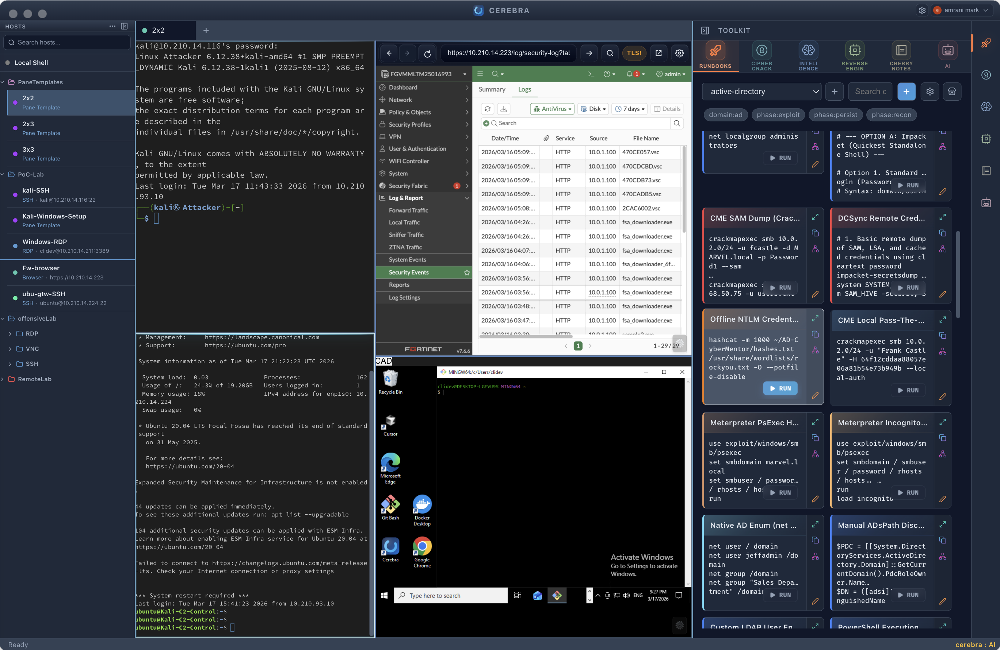
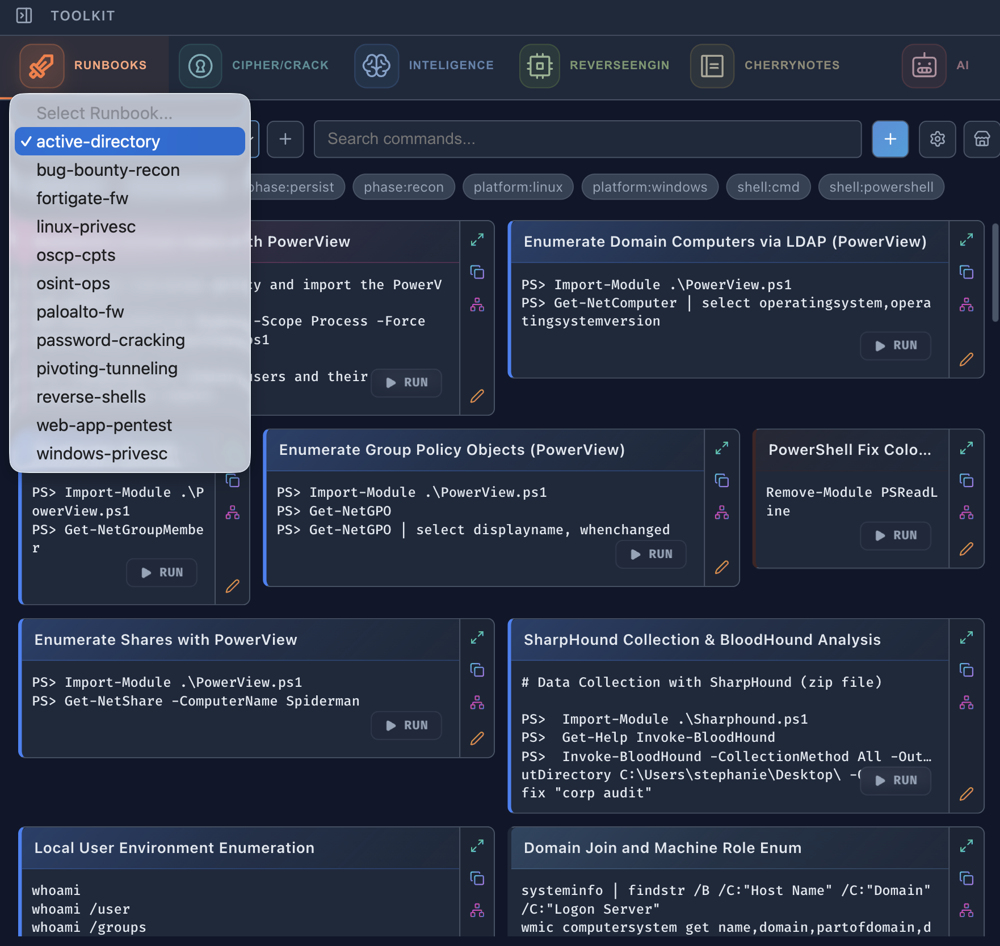
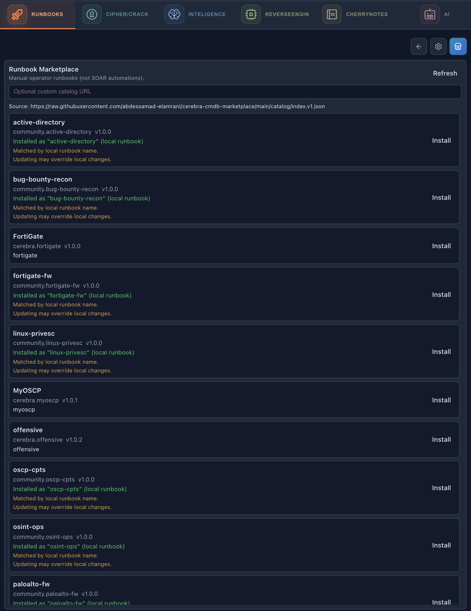
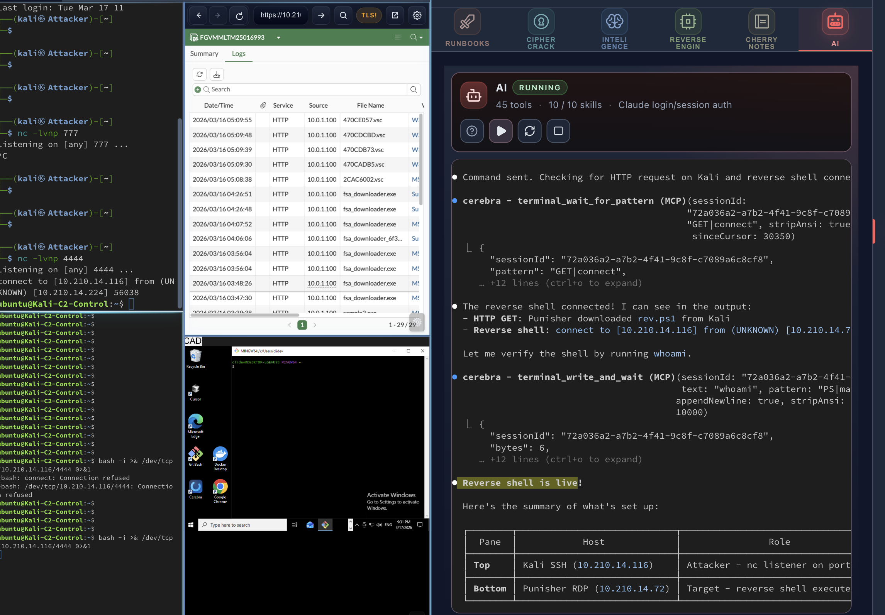
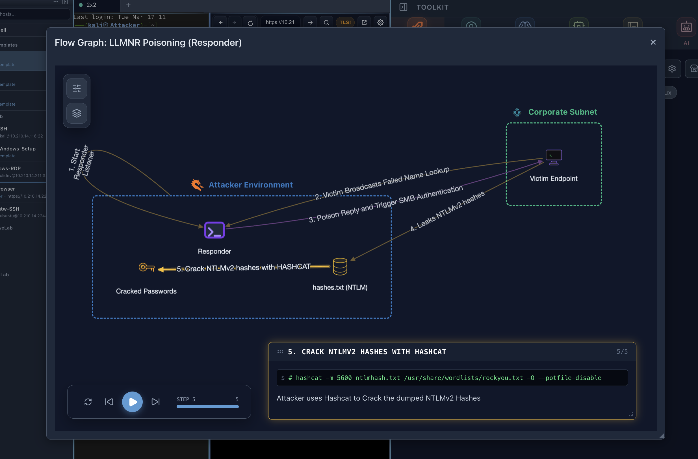
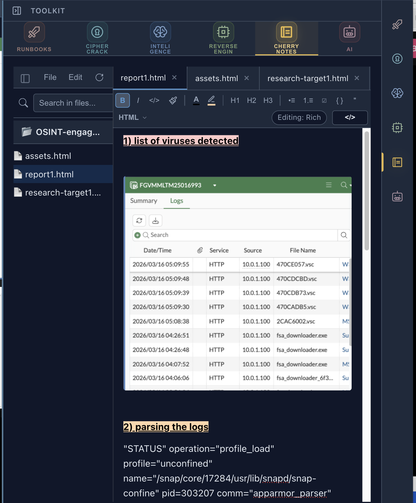
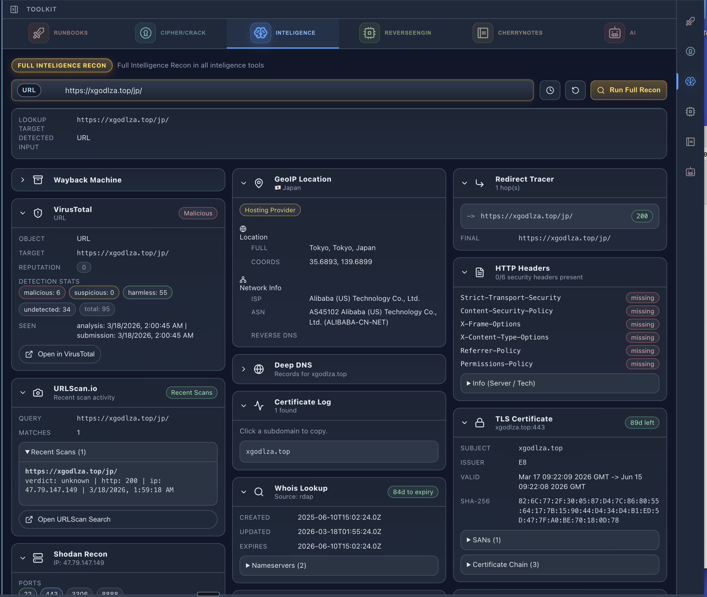
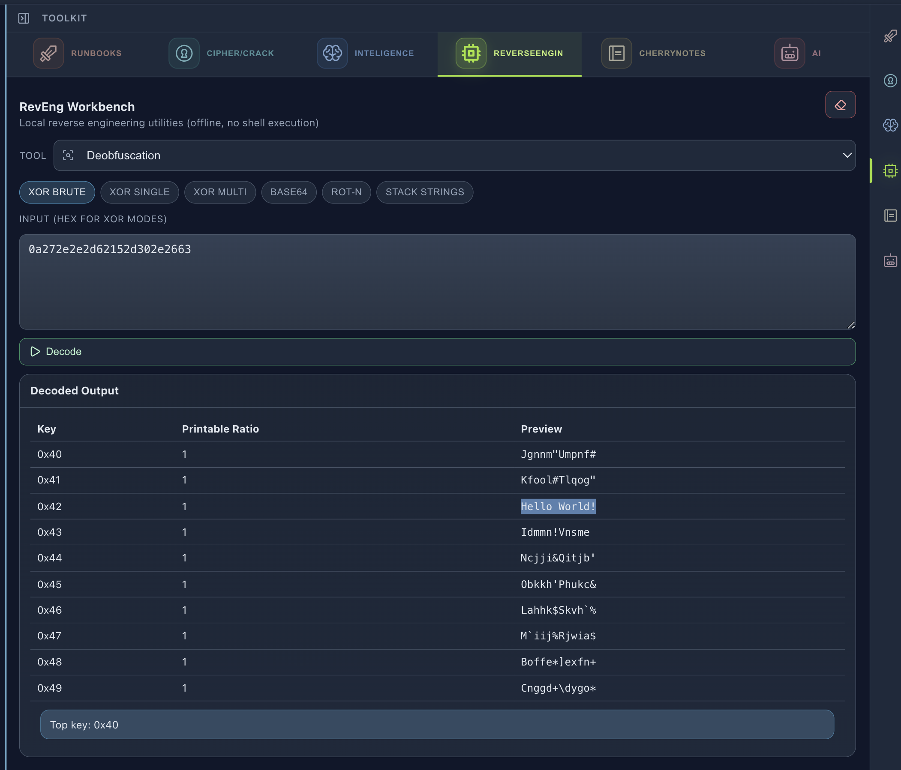
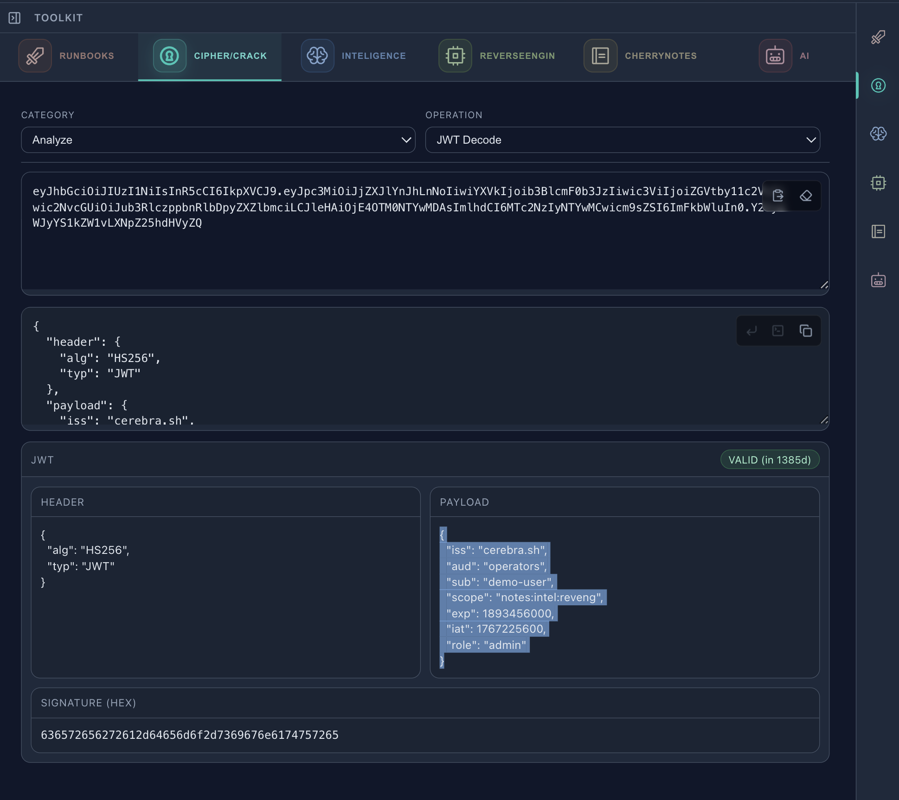

<p align="center">
  
</p>

<h1 align="center">Cerebra</h1>

<p align="center">
  <strong>An IDE for the CyberSecurity Professional</strong><br/>
  Hosts, sessions, runbooks, AI, graphs, notes, and analysis in one desktop flow.
</p>

<p align="center">
  <a href="https://www.cerebra.sh"><strong>www.cerebra.sh</strong></a> &middot;
  <a href="https://www.cerebra.sh/download">Download</a> &middot;
  <a href="https://github.com/abdessamad-elamrani/cerebra.sh/releases">Releases</a> &middot;
  <a href="https://github.com/abdessamad-elamrani/cerebra.sh/discussions">Discussions</a>
</p>

<p align="center">
  <sub>Visit <a href="https://www.cerebra.sh"><strong>www.cerebra.sh</strong></a> for full demos, screenshots, and downloads.</sub>
</p>

---

<p align="center">
  
</p>

## What is Cerebra?

Cerebra is a desktop application that unifies everything a cybersecurity professional touches — live terminal sessions, intelligence lookups, reverse engineering, cryptography and cracking utilities, attack-flow graphs, AI-assisted automation, runbooks, and operator notes — into a single multi-pane workspace. It connects to hosts over **SSH**, **RDP**, **VNC**, and **local shell** with persistent tabs, split panes, and reusable layout templates, so your workflow doesn't break when tasks change.

Instead of scattering work across dozens of browser tabs, CLI windows, and note-taking apps, Cerebra keeps execution, evidence, enrichment, and analysis side by side — where context is never more than one pane away.

### Core Pillars

- **Multi-protocol workspace** — SSH, RDP, VNC, and browser sessions live side by side in a split-screen interface with persistent tabs and reusable templates
- **Runbooks that execute, not just document** — reusable command cards inject directly into the active shell or pane, turning playbooks into one-click actions
- **AI with live context** — the AI Toolkit reasons over your running sessions, terminal output, and workspace state — not a detached chatbot with no visibility
- **Attack-flow visualization** — CyberViewer renders kill chains, pivot paths, and operational graphs connected to runbooks and evidence
- **Built-in intelligence & enrichment** — enrich domains, IPs, URLs, and hashes without leaving the workspace
- **Reverse engineering in-flow** — map APIs to ATT&CK, triage binaries, deobfuscate content, and extract IoCs alongside the live session
- **Cryptography & transforms** — decode JWTs, hash payloads, crack formats, and run quick transforms docked beside the shell

---

## Workflow Tools

### Runbooks

Reusable command cards that inject directly into the active shell or pane. Build once, execute everywhere — pentesting, OSCP, bug bounty, OSINT, cloud, and more.

<p align="center">
  
</p>

### Runbook Marketplace

Browse and discover community runbooks for common workflows — pentesting, offensive security, bug bounty, OSINT, network security, cloud, OSCP, CKS, CPTS, and more.

<p align="center">
  
</p>

### AI Toolkit

The AI Toolkit reasons over the live workspace — current sessions, terminal output, and operator context — instead of acting like a generic chatbot. Switch to **AI-Cyber Mode** and the AI can see and control everything: RDP, browser, SSH, intelligence tools, pentesting, graph building.

<p align="center">
  
</p>

### CyberViewer

Attack-flow graphs stay connected to runbooks and previews so the app captures both action and structure. Visualize kill chains, pivot paths, and operational flow without leaving the workspace.

<p align="center">
  
</p>

### Notes

Evidence, screenshots, code blocks, and operator notes captured in the same app. No more fragmenting across tools — everything stays beside the work.

<p align="center">
  
</p>

---

## Analysis Tools

### Intel

Enrich domains, URLs, IPs, and hashes from the same workspace without pivoting into a pile of browser tabs. Investigate indicators in-flow.

<p align="center">
  
</p>

### RevEng

Map suspicious APIs to ATT&CK, triage binaries, deobfuscate content, and extract IoCs — all in the same workspace that holds the live session.

<p align="center">
  
</p>

### Crypto

Decode JWTs, hash payloads, convert formats, and run utility transforms without copying data into random web tools. Quick transforms stay docked beside the shell.

<p align="center">
  
</p>

---

## Protocol Support

| Protocol | Description |
|----------|-------------|
| **SSH** | Real PTY-backed terminal sessions with persistent tabs and split panes |
| **RDP** | Docker-backed preferred mode with native fallback when needed |
| **VNC** | Integrated noVNC workflow inside the same workspace shell |
| **Local Shell** | Quick local sessions for drafting, testing, and operator utility work |

---

## Download

Current release: **v2.0.0** — available for macOS, Windows, and Linux.

| Platform | Arch | Format | Size | Get |
|----------|------|--------|------|-----|
| macOS | Apple Silicon | ZIP | 116 MB | [Download](https://www.cerebra.sh/download) |
| Windows Installer | x64 | EXE | 92 MB | [Download](https://www.cerebra.sh/download) |
| Windows Portable | x64 | EXE | 92 MB | [Download](https://www.cerebra.sh/download) |
| Linux AppImage | x64 | AppImage | 126 MB | [Download](https://www.cerebra.sh/download) |

> All builds, checksums, and verification details at [**www.cerebra.sh/download**](https://www.cerebra.sh/download)

### Installation Notes

**macOS** — The build is Apple-notarized. Extract the ZIP and move Cerebra to Applications.

**Windows** — Use the installer for a standard install, or the portable EXE to run directly without installation.

**Linux** — Make the AppImage executable (`chmod +x Cerebra-*.AppImage`) and run it. AppImage support is experimental while the distro matrix is completed.

---

## Full SHA-256 Checksums

```
06078ae8dc6e154920a23febfb2cdbd495d3e3a3145ce08123638020682afe4a  Cerebra-2.0.0-arm64-mac.zip
b733c974ab54ccd38081e11ee01658bc9c8454d75bebb555c82db0efd1e11337  Cerebra Setup 2.0.0.exe
50961f7cd82f91ff8a51f52c00e9cb7db5c5b682634b9a03dffb2bcf546230ce  Cerebra 2.0.0.exe
cff4a9e920bc0a9ee5e2ebc347f6415ea6995bcdcbca960f2b49e49bea2ede4d  Cerebra-2.0.0-x86_64.AppImage
```

---

## Community

- **Bug reports** — [Open an issue](../../issues/new?template=bug_report.yml)
- **Feature requests** — [Open an issue](../../issues/new?template=feature_request.yml)
- **Discussions** — [Join the conversation](../../discussions)

---

## License

Cerebra is proprietary software. See [LICENSE](LICENSE) for details.

---

<p align="center">
  <a href="https://www.cerebra.sh"><strong>www.cerebra.sh</strong></a><br/>
  <sub>Full product overview, video demos, and downloads</sub>
</p>
